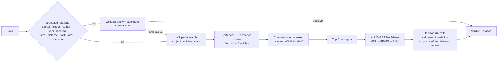

# FALXON: evidence-grounded claim verification

**FALXON** checks a factual claim against the public record and shows its evidence. It compares structured facts with **Wikidata**, retrieves passages from **Wikipedia**, ranks them with a neural **cross-encoder**, and weighs them with a **DeBERTa-v3 natural-language-inference model trained on FEVER**. When the evidence is weak, it says *Unverified* instead of guessing.

Everything is free and open: no paid APIs, no API keys, and every model runs locally on CPU.

> Research project by **Balaji R**. Full write-up: [docs/technical-report.md](docs/technical-report.md). Verdicts are automatic and can be wrong; every report lists the passages and source revisions it relied on.

---

## What it does

| | |
|---|---|
| **Check a claim** | One sentence in, one verdict out: *Supported*, *False*, *Unverified* or *Disputed*. The report includes the key passages, how the model read each one, and citations to the exact Wikipedia/Wikidata revisions. |
| **Check an article** | Paste text or a URL. FALXON extracts up to six check-worthy statements and verifies each one. |
| **Archive** | Every check gets a permanent, shareable report page. |
| **JSON API** | `POST /api/v1/verify`, `POST /api/v1/verify-article`, `GET /api/v1/reports/{id}`. Interactive docs are at `/api/docs`. |
| **Benchmark** | A reproducible evaluation on the FEVER 1.0 dev set, with thresholds tuned on a separate calibration split. |

## How it works



1. **Claim intake** (`falxon/claims.py`) normalises the input. For articles, a check-worthiness scorer keeps sentences with entities, numbers and declarative verbs, and drops opinion and hedging.
2. **Structured records** (`falxon/structured.py`) handle claims that free-text models get wrong: capitals, heads of government and state, authorship, founding and birth years, locations ("X is in Y", checked by walking Wikidata's territory, country and continent links), and comparisons that numbers can settle ("Mars is the largest planet in the Solar System", "Venus is the second planet from the Sun", "Jupiter is closer to the Sun than Mercury"), plus orbits and discoverers. Entity IDs and recorded measurements are compared, not strings. One counterexample is enough to call a superlative false; calling it true requires the whole comparison set. Ambiguity leads to abstention.
3. **Retrieval** (`falxon/retrieval/wikipedia.py`) builds queries from the subject phrase, named entities and the claim with negations removed, so a false claim isn't matched only to similarly worded text. It merges results, demotes disambiguated look-alikes ("Eiffel Tower (Paris, Texas)") and fetches whole articles at a pinned revision.
4. **Reranking** (`falxon/models.py`) scores every candidate passage with a cross-encoder and keeps the best eight, at most three per article.
5. **Inference**: the NLI model reads each top passage (premise) against the claim (hypothesis).
6. **Decision** (`falxon/aggregate.py`): a passage counts only if one label is both strong and well ahead of the others. Strong support and strong refutation together produce *Disputed*.

## Results

Run the benchmark yourself (see below). It writes `reports/benchmark.md` and `reports/benchmark.json`, and the website's Methodology page shows the numbers automatically.

| System | Dataset | Accuracy |
|---|---|---|
| FALCON v2: TF-IDF + logistic regression | LIAR, 6-class | 26.3% |
| FALCON v2: same model, true vs. false | LIAR, binary (majority class 56.7%) | 62.0% |
| **FALXON v5.3** | FALCON-60 hand-written claims, 3-class | **91.7%** (macro F1 91.5%; 94.6% precision when decisive; all 20 unverifiable claims correctly left unverified; run on 2026-10-08. Earlier runs: 78.3% without record checks, 80.0% with the first version of them) |
| **FALXON v5** | FEVER 1.0 dev, 3-class, held-out split | *see `reports/benchmark.md`* |

For context, published FEVER label-accuracy results with Wikipedia retrieval range from about 68% for the 2018 shared-task winner to about 80% for later BERT-era systems. FALXON uses off-the-shelf models with no FEVER-specific retrieval training, and it runs on a laptop CPU.

## Run it locally

Requires Python 3.10+. The first run downloads about 800 MB of open models from Hugging Face.

```bash
python -m venv .venv
# Windows: .venv\Scripts\activate     macOS/Linux: source .venv/bin/activate
pip install -r requirements-dev.txt
python -m scripts.download_models      # optional: pre-fetch the models
uvicorn web.app:app --port 8000
```

Open <http://127.0.0.1:8000>.

Check that Wikidata and Wikipedia are reachable and that the record checks give known answers:

```bash
python -m evaluation.bench doctor
```

Run the tests (offline, so no models or network are needed):

```bash
pytest -q
```

## Reproduce the benchmark

```bash
python -m evaluation.bench all --n 600
```

This command:

1. Downloads the FEVER 1.0 shared-task dev set into `evaluation/data/`.
2. Draws a balanced sample of 600 claims (seed 13) and splits it 200/400 into calibration and test.
3. Runs the full pipeline on every claim and caches raw outputs in `evaluation/runs/`, so the run can be interrupted and resumed.
4. Grid-searches the decision thresholds on the calibration split only, and writes `reports/thresholds.json`.
5. Scores the untouched test split, plus the 60 hand-written FALCON claims, and writes `reports/benchmark.{md,json}`.

On a typical laptop CPU a claim takes 3–10 seconds, so 600 claims take roughly 1–2 hours. Use `--n 150` for a quick run.

## Deploy for free on Hugging Face Spaces

1. Create a new Space, choose **Docker**, and select the free **CPU basic** hardware.
2. Push this repository to the Space. The included `Dockerfile` installs CPU-only PyTorch, bakes the models into the image and serves on port 7860.
3. Add this header to the Space's README:

```yaml
---
title: FALXON
emoji: 📰
colorFrom: gray
colorTo: gray
sdk: docker
app_port: 7860
---
```

## Project layout

```
falxon/            engine: claims, retrieval, structured checks, models, decision rule, storage
web/               FastAPI app, Jinja templates, editorial CSS, self-hosted fonts
evaluation/        benchmark runner, FALCON-60 claims
reports/           calibrated thresholds and benchmark results
tests/             offline unit and integration tests (fake Wikipedia/Wikidata/models)
legacy-js/         the earlier browser-only prototype (kept for reference)
```

## Limitations

- **Scope.** Sources are English Wikipedia and Wikidata only, so breaking news, local events and claims about private people are usually out of reach.
- **Independence.** Wikipedia is one publisher. Several agreeing pages are not independent corroboration.
- **Model errors.** NLI models can be misled by scope (a state capital versus a national capital), numbers, negation and time.
- **Dataset age.** FEVER labels were written against 2017 Wikipedia, and a few have changed since.
- **Confidence.** "Confidence" is the model probability for the decisive passage, not a calibrated probability that the claim is true.

## References

- Thorne et al. (2018). *FEVER: a large-scale dataset for Fact Extraction and VERification.* NAACL.
- He et al. (2021). *DeBERTaV3.* arXiv:2111.09543. Model: `MoritzLaurer/DeBERTa-v3-base-mnli-fever-anli`.
- Nie et al. (2020). *Adversarial NLI.* ACL.
- Reimers & Gurevych (2019). *Sentence-BERT.* Model: `cross-encoder/ms-marco-MiniLM-L-6-v2`.
- Wang et al. (2017). *"Liar, Liar Pants on Fire": A New Benchmark Dataset for Fake News Detection.* ACL (FALCON v2 baseline).

Code © 2026 Balaji R. Models, fonts (SIL OFL) and retrieved text keep their own licenses.
